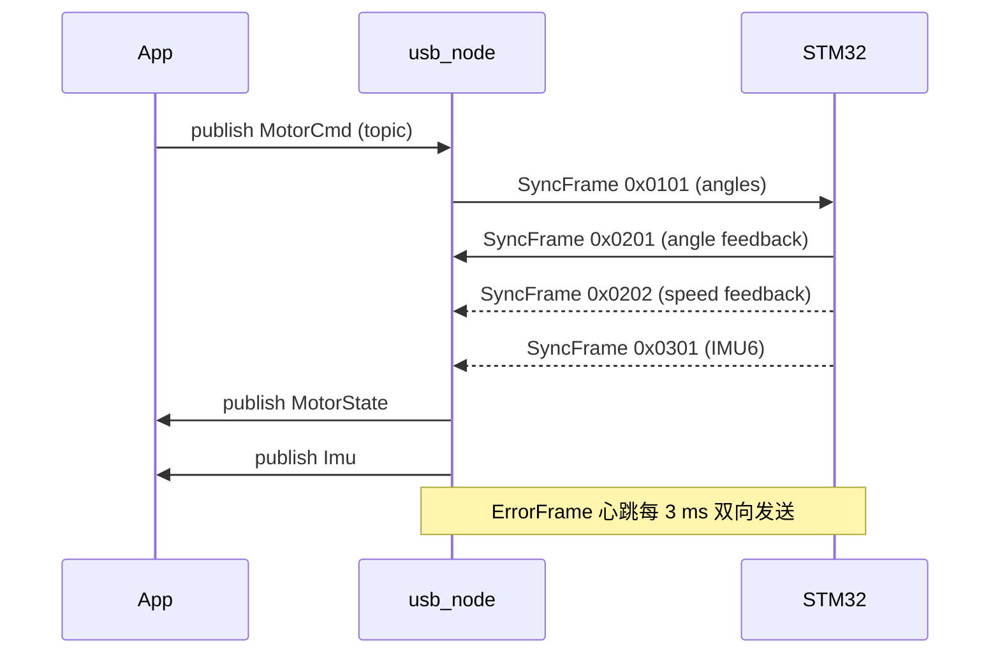

# ARES USB 通信包设计文档

*最后更新: 2025-07-10*

## 1. 设计目标
1. 复用 `ares_comm` 中成熟的 USB Bulk 协议实现思路，新增对 **9 个电机角度 / 速度** 以及 **IMU 六轴数据** 的传输支持。
2. 提供 **上位机 (ROS 2)** 与 **下位机 (STM32)** 间的双向可靠通信，满足 ≤ 3 ms 心跳、64 Byte 满速同步帧的实时性要求。
3. 遵循 ROS 2 C++/Python 规则，保持可维护、易移植、易扩展。

---

## 2. 协议层设计
### 2.1 帧类型继承
沿用 `ares_comm/ARES_bulk_library` 已定义的 4 类帧头：
| 帧头 | 说明                 | 向    | 典型用途             |
|------|----------------------|-------|----------------------|
| `0xCAFE` | ExecFrame          | Host → MCU | 单指令 / 参数设置       |
| `0xC0DE` | ExecReplyFrame     | MCU → Host | 指令返回值 / ACK       |
| `0x5A5A` | SyncFrame          | 双向      | **实时数据流**           |
| `0xCADE` | ErrorFrame         | 双向      | 错误 / 心跳           |

### 2.2 数据 ID 定义 (SyncFrame)
| DataID | 方向 | 数据含义 | Payload 字节布局 |
|--------|------|----------|-----------------|
| `0x0101` | Host → MCU | **MotorCmd** 电机角度 (9×float32) | `float32 angle[9]` = 36 B |
| `0x0201` | MCU → Host | **MotorState-A** 反馈角度 (9×float32) | 同上 |
| `0x0202` | MCU → Host | **MotorState-S** 反馈速度 (9×float32) | 同上 |
| `0x0301` | MCU → Host | **IMU6** 3×Accel + 3×Gyro | `float32 accel[3]` + `float32 gyro[3]` = 24 B |

> 注：
> 1. 所有浮点数均采用 **IEEE-754 float32 大端序**（网络字节序）。
> 2. 单帧即可完整承载 9×float32 (36 B)。若未来电机数增多，可使用递增 DataID 扩展。

### 2.3 功能码定义 (ExecFrame)
| FuncID | 方向 | 说明 |
|--------|------|-----|
| `0x0001` | Host → MCU | 保存零位校准 |
| `0x0002` | Host → MCU | 查询固件版本 |
| `0xF001` | MCU → Host | Bootloader 跳转完成 |
| … | … | 后续扩展 |

### 2.4 CRC 与心跳
* CRC-8 (多项式 0x07)，计算范围 **不含** Head 与 Tail。
* 每 `3 ms` MCU 发送 `ErrorFrame` 心跳 (`request_id=0xFF, error_code=0x0100`). Host 复用现有 `heartbeat_loop()` 定时发送同帧。

### 2.5 多频率帧调度策略
不同 `DataID` 对应的数据刷新率不同，下位机需按固定周期将帧写入 USB FIFO，上位机按到达顺序解析。

| DataID | 期望周期 | 典型频率 | 说明 |
|--------|----------|---------|------|
| `0x0101` (MotorCmd) | 按需 | ≤ 100 Hz | 由上位机主动发送，依据控制循环调度 |
| `0x0201/0x0202` (MotorState) | 5 ms | 200 Hz | STM32 实时回传，优先级 **高** |
| `0x0301` (IMU6) | 2 ms | 500 Hz | STM32 回传，优先级 **最高** |
| `ErrorFrame` (心跳) | 3 ms | ≈333 Hz | 双向，检测链路健康 |

> *优先级*：IMU > MotorState > Heartbeat。

#### 下位机发送侧
1. **环形发送队列**：不同优先级对应多级环形缓冲。高优先级队列溢出时覆盖低优先级，防止高频数据阻塞。
2. **帧间隔控制**：使用 `SysTick` 计数器确保各 DataID 最小发送间隔不小于表中周期。
3. **批量写出**：可一次 `libusb_write()` 发送多帧（64 B × N），减少握手损耗。

#### 上位机接收侧
1. **时间戳队列**：`usb_read_loop()` 到帧即刻推送至无锁环形队列，随后由 `parser_thread` 按 DataID 发布 ROS 话题。
2. **丢包检测**：维护上一帧到达 `std::chrono::steady_clock::time_point`，若超过 2× 周期触发 `WARN` 日志。
3. **回压保护**：若解析线程滞后，读线程仍写入环形缓冲，当即用最新帧覆盖旧帧（采用 2^n 大小指数环）。

---

## 3. ROS 2 接口层设计
### 3.1 消息
```
# msg/MotorCmd.msg
float32[9] angle
---
# msg/MotorState.msg
float32[9] angle
float32[9] speed
---
# sensor_msgs/Imu 已复用
```

### 3.2 话题 / 服务
| 名称 | 类型 | 方向 | 描述 |
|------|------|------|------|
| `/motor_cmd` | MotorCmd | App → usb_node | 发送目标角度 |
| `/motor_state` | MotorState | usb_node → App | 反馈电机状态 |
| `/imu/data_raw` | sensor_msgs/Imu | usb_node → App | IMU 六轴原始数据 |
| `/exec` | ares_comm/srv/Execute (保持兼容) | 双向 | 异步指令调用 |

### 3.3 节点
1. **usb_bridge_node (C++)**  
   * 封装 `Protocol` 类；订阅 `/motor_cmd`，**仅**打包为 `SyncFrame(0x0101)` 发送。
   * 在 `sync_cb_` 中根据 `DataID` 分发并发布 ROS 消息。
   * 维护心跳与错误回调。

2. **diagnostic_node (Python)** *(可选)*  
   * 订阅 `/motor_state`、`/imu/data_raw`；发布 `/diagnostics`。

---

## 4. 目录结构
```
ares_usb_comm/
├── ARES_bulk_library/         # 复用/重命名, 仅新增 DataID/FuncID
├── include/ares_usb_comm/
│   ├── protocol.hpp
│   └── motor_types.hpp
├── msg/
│   ├── MotorCmd.msg
│   └── MotorState.msg
├── src/
│   ├── usb_bridge_node.cpp
│   └── ...
├── launch/
│   └── bringup.launch.py
├── CMakeLists.txt
└── package.xml
```

---

## 5. 上下位机数据流程


---

## 6. 关键实现要点
1. **Payload 打包解包**：
   * 使用 `std::array<float, 9>` 直接 `memcpy()` 至 `SyncFrame::data` 发送角度。
2. **线程安全**：USB 读写使用互斥锁 `usb_mutex_` 与 `std::atomic<bool> running_`。**读写分别位于独立线程，实现“伪”全双工**。
3. **参数化**：`DataID`、缩放系数、心跳周期通过 ROS `params` 配置，便于实验调优。
4. **兼容旧协议**：保留原 `ExecFrame` 流程及心跳，实现平滑迁移。
5. **多频率调度**：实现环形缓冲 + 优先级仲裁，保证高频 IMU 帧不被低频内容饿死。

---

## 7. 后续工作
1. 完成 `MotorCmd`、`MotorState` 消息定义与 `package.xml` 依赖声明。
2. 根据此文档实现 `usb_bridge_node.cpp`，并在 `progress.md` 更新日志。
3. 与 STM32 固件端对齐 DataID 与量程缩放，实现端到端回环测试。 

---

## 8. USB 全双工特性与注意事项
1. **Endpoint 独立**：Bulk `EP_OUT (0x01)` 与 `EP_IN (0x81)` 在硬件上分离，理论支持全双工。Host 每 125 µs 可调度多个事务，满足上表带宽（< 1 MBit/s）。
2. **Host 轮询模型**：USB 读依赖主机发起，故需持续调用 `libusb_bulk_transfer()` 或使用异步 `libusb_submit_transfer()` 保持 IN 端带宽。
3. **MTU 对齐**：保持每帧 ≤ 64 B，避免分段；若批量写需控制在 64×N 字节。
4. **突发写入**：上位机短时间内发送大量 MotorCmd 时，需睡眠 `0.1 ms` 间隔，避免填满 Device FIFO。
5. **延迟统计**：在心跳帧中复用 `error_code` 低字节上报 MCU->Host 单向延迟，以供调参。

--- 