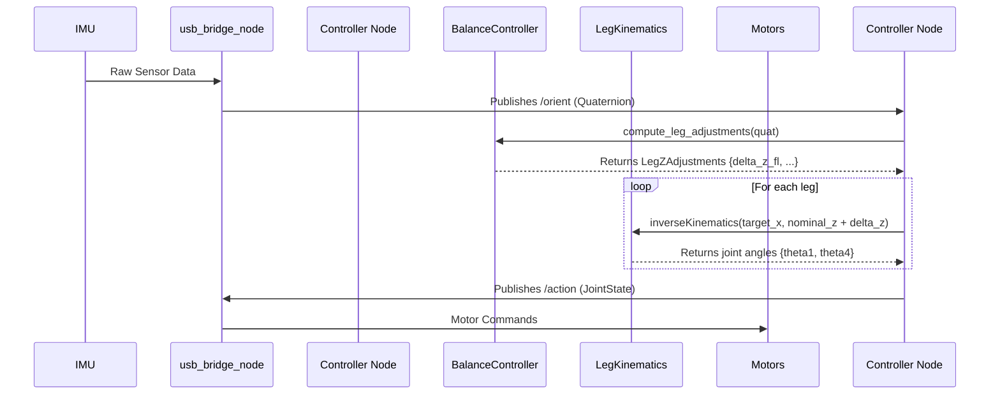

# 姿态自平衡控制器设计文档 (C++)

## 1. 设计目标

利用板载 IMU（惯性测量单元）提供的实时姿态数据（横滚 a Roll 与俯仰 - Pitch），通过一个闭环控制器动态调整四条腿的长度，从而抵消外部扰动或地形变化带来的机身倾斜，使机器狗的躯干始终保持水平。

## 2. 核心思路 (Control Strategy)

我们将采用一个经典的 **PD 控制器** (Proportional-Derivative) 来实现姿态平衡。

1.  **获取姿态误差**:
    *   **目标姿态**: 躯干完全水平，即 `target_roll = 0`，`target_pitch = 0`。
    *   **实际姿态**: 从 IMU 传感器实时获取当前的 `actual_roll` 和 `actual_pitch`。
    *   **姿态误差**: `error = target_angle - actual_angle`。

2.  **计算调节量**:
    *   控制器根据姿态误差，计算出一个修正量。为简化起见，我们先实现一个 **P 控制器 (比例控制器)**，它能满足基本的平衡需求。
    *   `correction = Kp * error`
    *   其中 `Kp` 是比例增益，一个需要调试的参数，决定了控制器对误差的反应强度。

3.  **执行调节**:
    *   控制器的输出（`correction`）最终需要转化为对四条腿长度的调整。
    *   例如，当机身向前倾斜（pitch > 0）时，控制器应计算出一个修正量，使得**前腿伸长**、**后腿缩短**，从而将机身“抬”回水平位置。

## 3. 实现步骤 (Implementation Plan)

### 第 1 步: 创建 `BalanceController` 类

为了保证代码的模块化和可重用性，我们将平衡控制的核心逻辑封装在一个独立的 C++ 类中。

*   **文件**:
    *   `src/aresdog_controller/include/aresdog_controller/balance_controller.hpp`
    *   `src/aresdog_controller/src/balance_controller.cpp`
*   **功能**:
    *   存储 PD 控制器的增益参数（`kp_roll_`, `kp_pitch_`, `kd_roll_`, `kd_pitch_`）。
    *   提供一个 `compute_leg_adjustments()` 公共方法。
*   **接口 (`balance_controller.hpp`)**:
    ```cpp
    #include "geometry_msgs/msg/quaternion.hpp"
    
    // 用于返回四条腿 Z 轴调整量的结构体
    struct LegZAdjustments {
      float fl; // Front-Left
      float fr; // Front-Right
      float rl; // Rear-Left
      float rr; // Rear-Right
    };
    
    class BalanceController {
    public:
      // 构造函数，用于设置 Kp, Kd 等增益
      BalanceController(float kp_roll, float kp_pitch, ...);
    
      // 输入当前 IMU 姿态，计算并返回四条腿的 Z 轴调整量
      LegZAdjustments compute_leg_adjustments(const geometry_msgs::msg::Quaternion& current_orientation);
    
    private:
      // PID 增益等私有成员
      float kp_roll_, kp_pitch_;
    };
    ```

### 第 2 步: 更新主控节点 `aresdog_controller_node`

主节点将作为“大脑”，集成 `BalanceController` 和 `LegKinematics`，处理 ROS 通信。如果该节点不存在，我将为您创建 `aresdog_controller_node.cpp`。

*   **初始化阶段**:
    1.  创建 `rclcpp::Node` 实例。
    2.  从 ROS 参数服务器加载 `Kp` 等增益，并用它们创建 `BalanceController` 的实例。
    3.  根据 `leg_kinematics.md` 中定义的连杆长度（L3=0.224, L4=0.09），创建一个 `LegKinematics` 实例。
    4.  **订阅** 来自 `usb_bridge_node` 的 IMU 话题（根据设计文档，应为 `/orient`，类型 `geometry_msgs/msg/Quaternion`）。
    5.  **创建发布器**，用于向 `/action` 话题发布电机指令（`sensor_msgs/msg/JointState`）。
    6.  定义一个**默认站姿 (Nominal Stance)**，即机器人水平时，每条腿足端的默认 (x, z) 坐标。例如：`nominal_foot_pos_ = {0.0f, -0.2f}`。

*   **控制循环 (在 IMU 消息的回调函数中)**:
    1.  接收到新的 IMU 数据 (`geometry_msgs::msg::Quaternion`)。
    2.  调用 `balance_controller_->compute_leg_adjustments()`，传入 IMU 数据，获得四条腿的 Z 轴调整量 `delta_z`。
    3.  **循环处理四条腿**:
        a. 计算每条腿的**目标足端坐标**: `target_z = nominal_foot_pos_.z + delta_z`。
        b. 调用 `leg_kinematics_->inverseKinematics()`，传入目标足端坐标 `(nominal_foot_pos_.x, target_z)`，解算出所需的两个电机角度 `theta1` 和 `theta4`。
        c. 如果逆解失败（目标点超出工作空间），则打印警告并使用上一次有效指令，防止机器人腿部“抽搐”。
    4.  将计算出的 8 个电机目标角度填充到 `sensor_msgs/msg/JointState` 消息中。
    5.  **发布**该消息到 `/action` 话题。

### 第 3 步: 更新 `CMakeLists.txt`

为了让我们的新 C++ 代码能够被编译和链接，需要：
1.  在 `add_executable()` 中添加 `src/aresdog_controller_node.cpp` 和 `src/balance_controller.cpp`。
2.  在 `ament_target_dependencies()` 中添加依赖，如 `rclcpp`、`geometry_msgs` 和 `sensor_msgs`。

### 3.5 执行器映射与符号约定

本章节详细说明了将运动学解算出的理论角度，转换为驱动物理电机所需的正确指令值的关键步骤。此版本根据最新的硬件约定进行了修订。

**运动学约定 (Kinematic Convention):** `LegKinematics` 解算器遵循标准的数学约定，即**逆时针 (CCW) 为正**。

**硬件约定 (Hardware Convention)（朝向狗头部）:**
*   对于**左侧电机 (FL_O, RL_O, FR_I, RR_I)** 上的所有电机：**顺时针 (CW) 旋转为负**。这意味着逆时针 (CCW) 为正。
*   对于**右侧电机 (FL_I, RL_I, FR_O, RR_O)** 上的所有电机：**顺时针 (CW) 旋转为正**。这意味着逆时针 (CCW) 为负。

这导致了如下的符号修正和偏移量。我们假定运动学角度 `theta1` 对应电机 (`FL_O, RL_O, FR_I, RR_I`)，`theta4` 对应电机 (`FL_I, RL_I, FR_O, RR_O`)。表格顺序已根据 `usb_comm` 设计文档中的电机索引排列。

从右侧观察 ，顺时针为正

| 索引 | 关节名称 | 运动学角度 | 腿部 | 最终指令公式 |
|:----:|:-------------------|:----------:|:----:|:----------------------|
| 0    | `FL_thigh_joint_i` | `theta1_fl`| 左前  | `-theta1`   |
| 1    | `FL_thigh_joint_o` | `theta4_fl`| 左前  | `theta4_fl+PI`          |
| 2    | `FR_thigh_joint_i` | `theta1_fr`| 右前  | `+theta1_fr`   |
| 3    | `FR_thigh_joint_o` | `theta4_fr`| 右前  | `-(theta4_fr + M_PI)`          |
| 5    | `RL_thigh_joint_i` | `theta4_rl`| 左后  | `-(theta4_rl + M_PI)`   |
| 6    | `RL_thigh_joint_o` | `theta1_rl`| 左后  | `theta1_rl`          |
| 7    | `RR_thigh_joint_i` | `theta4_rr`| 右后  | `theta4_rr + M_PI`   |
| 8    | `RR_thigh_joint_o` | `theta1_rr`| 右后  | `-theta1_rr`          |

*注：所有内侧电机 (`_i`) 的 `+M_PI` 偏移量是基于初始固件代码的设定，反映了机械安装上的固定差异。*

主控制器节点 (`aresdog_controller_node`) 将负责严格按照此表来实现该映射逻辑。

### 4. 数据流图

